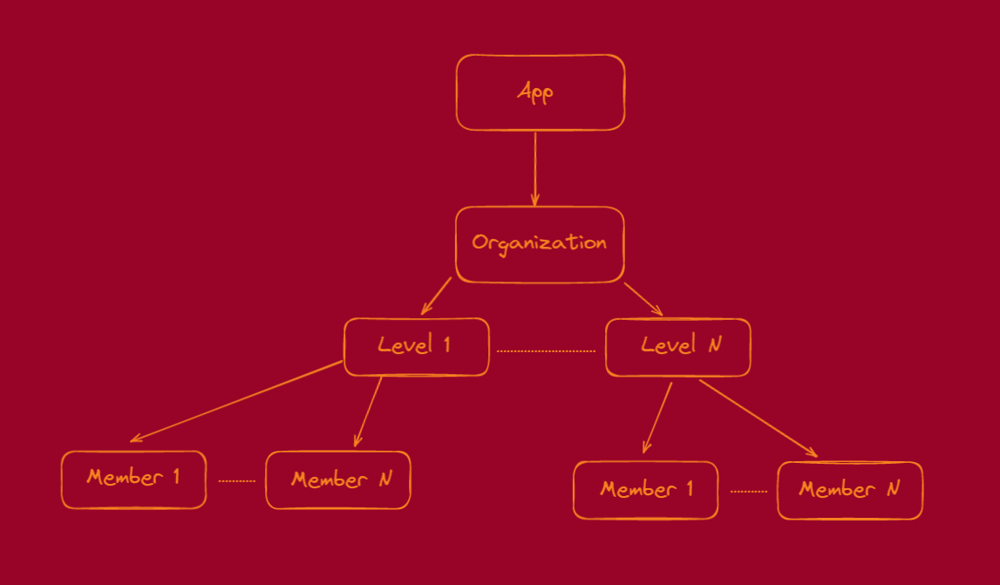
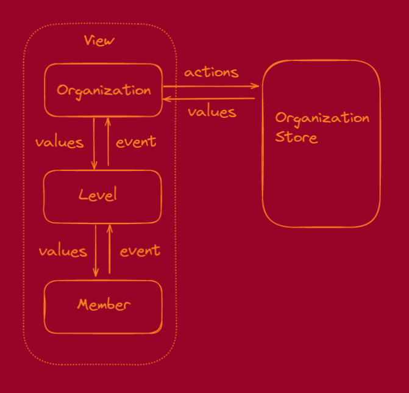

# SPQRT

An organizational chart in react

## Components
### Components and BoundedContext Hierarchy



### Components and Data communication

Each components has parent communication event and each parent has child communication by props values.

The data communication is doing by the boundedContext Organization Chart.

This allow us follow the flux pattern with a unidirectional data flow and have components dummy as posible to reuse in some different boundedContexts.



## State
### State Management

All Organization Chart state is managed by the react Organization Context API by our own provider and our own hook **useOrganization**.

This allow us manipulare the state of the Organization Chart in a single centralize place and our hook takes the glue role to do this job in the view.

Take into account that all business chart organization logic is split in some different layer of services, models and context api pieces that we can consume in our application.

## Levels

We could customize  what kinds of titles a level has.

we only need to change the level enum configuration in `./src/organization/levels.model.ts`

```typescript
const Levels = [
  [Title.imperatorAugustus],
  [Title.proefectusCastrorum, Title.legatus],
  [Title.tribunus],
  [Title.centurio],
  [Title.decurio],
  [Title.legionnaire],
];
```

## Available Scripts

In the project directory, you can run:

### `yarn`

Install all dependencies, you need yarn to run this command.

Install yarn whit the official [getting started](https://yarnpkg.com/getting-started/install).

### `yarn start`

Runs the app in the development mode.\

Open [http://localhost:3000](http://localhost:3000) to view it in the browser.

The page will reload if you make edits.\
You will also see any lint errors in the console.

### `yarn test`

Launches the test runner in the interactive watch mode.\
See the section about [running tests](https://facebook.github.io/create-react-app/docs/running-tests) for more information.

### `yarn run build`

Builds the app for production to the `build` folder.\
It correctly bundles React in production mode and optimizes the build for the best performance.

The build is minified and the filenames include the hashes.\
Your app is ready to be deployed!
